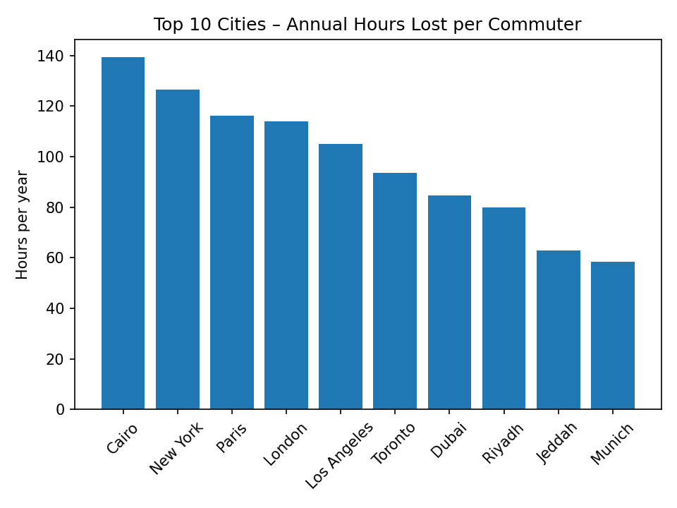
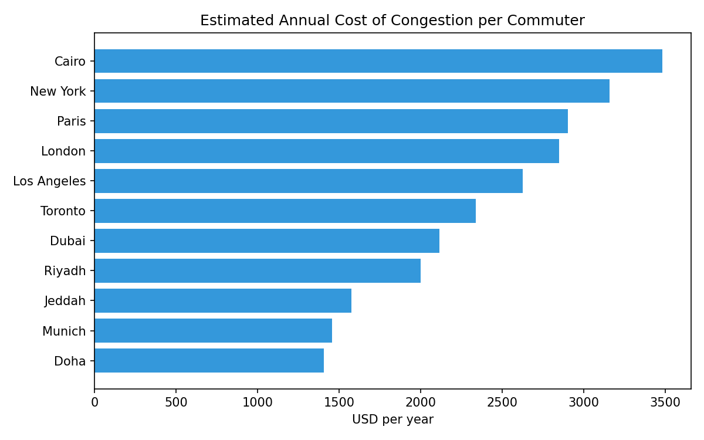

# Traffic Congestion Analyzer

Analyze traffic congestion data across cities and estimate how many hours commuters lose per year sitting in traffic. Generates charts comparing cities by hours lost and cost impact.

## Setup

```bash
pip install -r requirements.txt
```

## Usage

```bash
python -m src.main
```

This will:
- Load data from `data/traffic_index_sample.csv`
- Calculate hours lost, cost impact, and congestion index per city
- Print a ranked summary to the console
- Save charts to `plots/` and the summary table to `results/`

## Running Tests

```bash
pip install pytest
pytest tests/
```

## Data Format

The input CSV needs these columns:

| Column | Description |
|--------|-------------|
| city | City name |
| country | Country name |
| year | Data year |
| congestion_pct | Average congestion level (0-100) |
| avg_commute_min | Average one-way commute in minutes |

## Method

Annual hours lost = `(avg_commute_min * 2) * (congestion_pct / 100) * 250 workdays / 60`

Cost impact = hours lost * estimated hourly wage ($25)

## Results

The computed table (ranked by hours lost) lives in `results/summary.md` and `results/summary.csv` after each run.




